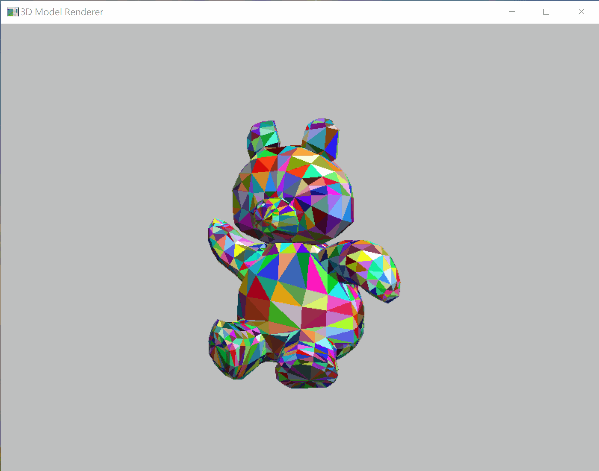
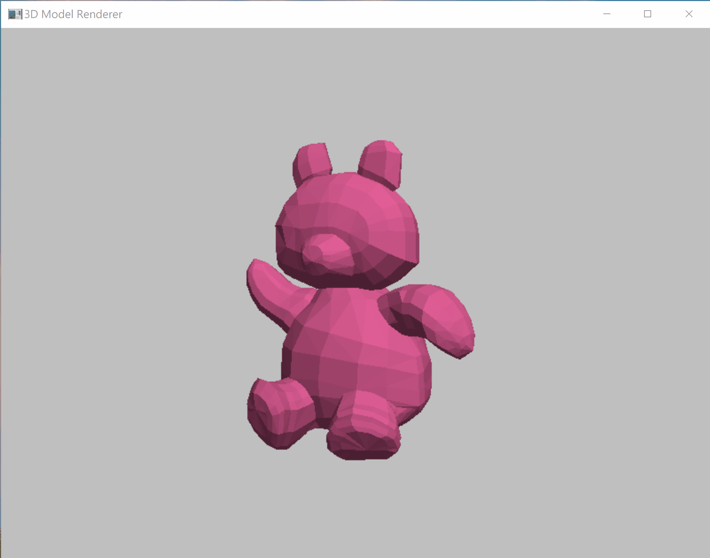
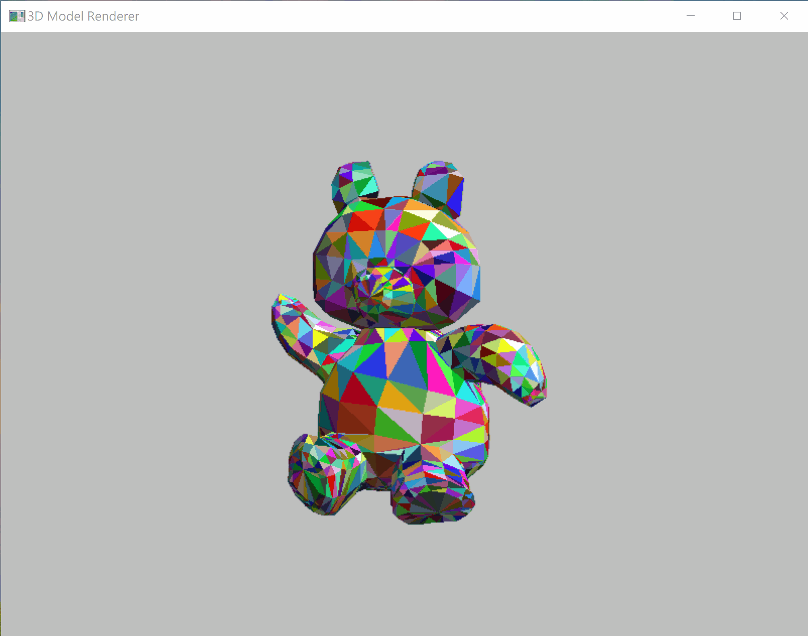
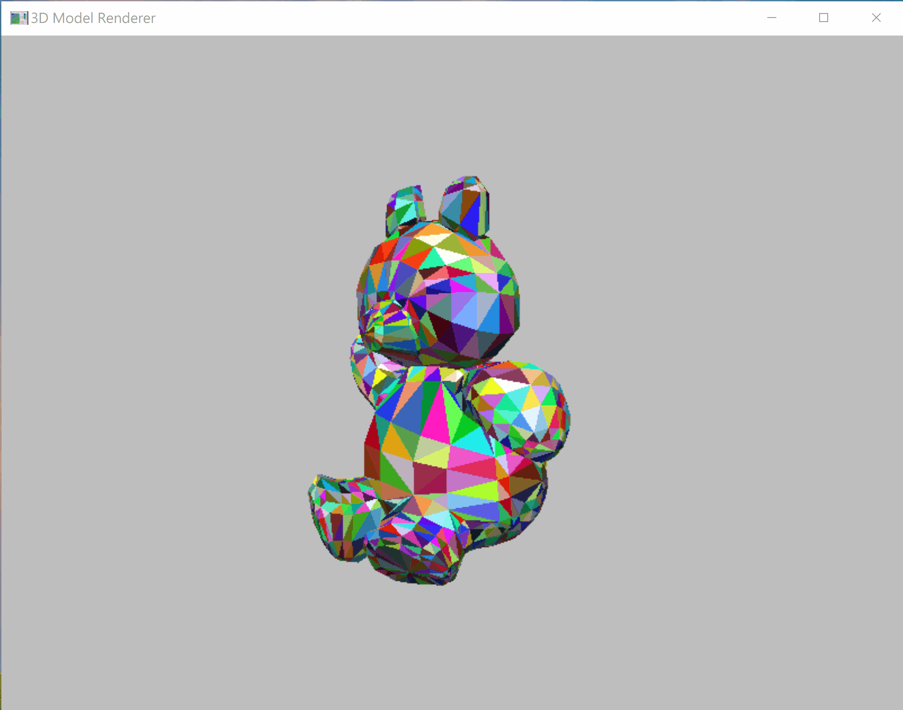

# OpenGL Obj Viewer

This is the NTUT 113-2 Computer Graphics Midterm Project, a program developed using the OpenGL library to load .obj files and render 3D models.

## Features

- Loads and renders .obj files with vertex and face data.
- Supports point, line, and face rendering modes.
- Supports single-color and random-color rendering modes.
- Enables object rotation, translation, and scaling.
- Enables camera movement and orbiting.

## Demo

Show point, line, and face rendering modes for the object.



Show single-color and random-color rendering modes.



Rotate and translate the object.



Scale the object using the mouse wheel or the `k` and `l` keys.


Move the camera away from the object, then press `Ctrl` to refocus the camera on the object.



Orbit the camera around the object leftward and upward.


## Prerequisites

- Visual Studio 2022:
  - Install the "Desktop development with C++" workload.
  - Includes MSBuild 17.x and MSVC compiler.
- FreeGLUT 3.0+:
  - Requires `freeglut.lib`, `freeglut.h`, and `freeglut.dll`.

## Installation

### Windows (Visual Studio)

```shell
msbuild
```

After the build is complete, the executable can be found in the .\x64\Debug path (this may vary depending on your platform). Run the executable from the current working directory to see the results.

```shell
.\x64\Debug\opengl-obj-viewer.exe
```

If you want to add custom .obj file, you can append file name as parameters (more than one is allowed, separated by spaces). I will use the file `.\model_file\double_octahedron.obj` as an example.

```shell
.\x64\Debug\opengl-obj-viewer.exe .\model_file\double_octahedron.obj
```

Show the execution result.


## Controls

Use the following keyboard to interact with the object and camera:

| Key/Action             | Description                                 |
| ---------------------- | ------------------------------------------- |
| `Esc`                  | **Exit** program                            |
| `r`                    | Reset model and camera position             |
| `q`                    | Translate object along positive X-axis      |
| `a`                    | Translate object along negative X-axis      |
| `w`                    | Translate object along positive Y-axis      |
| `s`                    | Translate object along negative Y-axis      |
| `e`                    | Translate object along positive Z-axis      |
| `d`                    | Translate object along negative Z-axis      |
| `1`                    | Rotate object positively around X-axis      |
| `2`                    | Rotate object positively around Y-axis      |
| `3`                    | Rotate object positively around Z-axis      |
| `4`                    | Rotate object negatively around X-axis      |
| `5`                    | Rotate object negatively around Y-axis      |
| `6`                    | Rotate object negatively around Z-axis      |
| `k` / `Mouse Wheel Up`   | Scale object up (Zoom in)                   |
| `l` / `Mouse Wheel Down` | Scale object down (Zoom out)                |
| `Up Arrow`             | Move camera forward                         |
| `Down Arrow`           | Move camera backward                        |
| `Left Arrow`           | Move camera left                            |
| `Right Arrow`          | Move camera right                           |
| `m`                    | Move camera up                              |
| `n`                    | Move camera down                            |
| `F1`                   | Orbit camera left around object             |
| `F2`                   | Orbit camera right around object            |
| `F3`                   | Orbit camera up around object               |
| `F4`                   | Orbit camera down around object             |
| `Ctrl`                 | Re-center camera focus on the object        |
