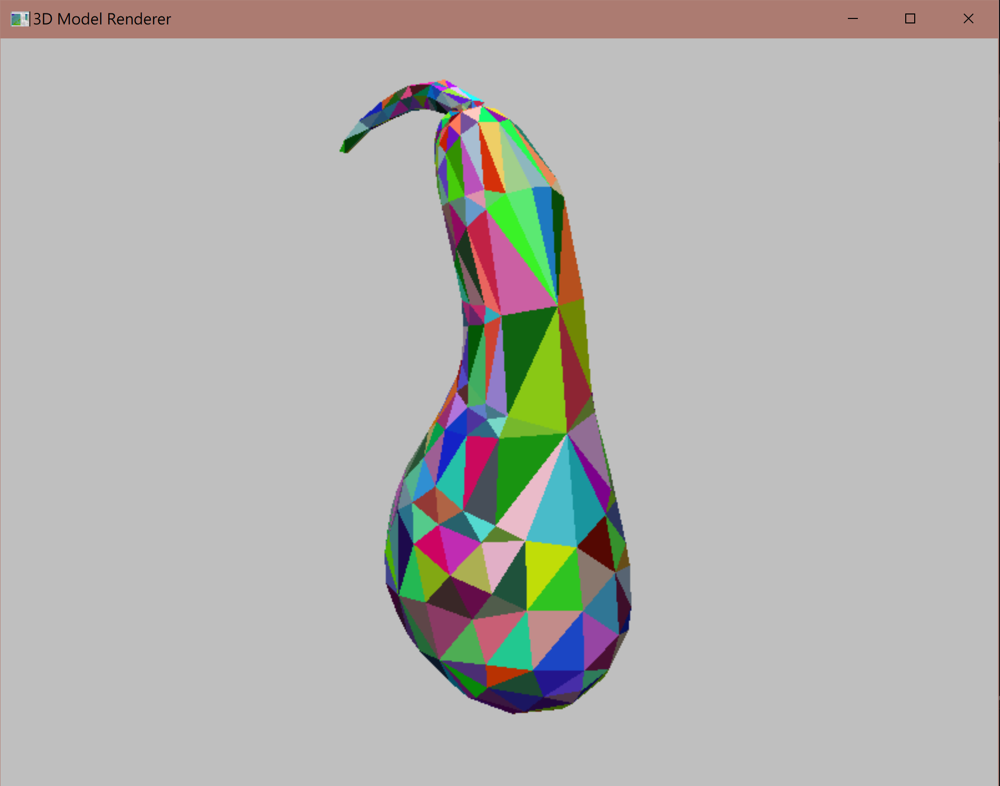

# OpenGL Obj Viewer

This is the NTUT 113-2 Computer Graphics Midterm Project, a program developed using the OpenGL library to load .obj files and render 3D models.

## Features

- Loads and renders .obj files with vertex and face data.
- Supports point, line, and face rendering modes.
- Supports single-color and random-color rendering modes.
- Enables object rotation, translation, and scaling.
- Enables camera movement and orbiting.

## Demo

...

## Prerequisites

- Visual Studio 2022:
  - Install the "Desktop development with C++" workload.
  - Includes MSBuild 17.x and MSVC compiler.
- FreeGLUT 3.0+:
  - Requires `freeglut.lib`, `freeglut.h`, and `freeglut.dll`.

## Installation

### Windows (Visual Studio)

```shell
msbuild
```

After the build is complete, the executable can be found in the .\x64\Debug path (this may vary depending on your platform). Run the executable from the current working directory to see the results.

```shell
.\x64\Debug\opengl-obj-viewer.exe
```

If you want to add custom .obj file, you can append file name as parameters (more than one is allowed, separated by spaces). I will use the file `.\model_file\double_octahedron.obj` as an example.

```shell
.\x64\Debug\opengl-obj-viewer.exe .\model_file\double_octahedron.obj
```

The results.


